# GNN Link Prediction Methods: Visual Guide

This document explains the two core components of our knowledge graph link prediction model: **RGCN (Encoder)** and **DistMult (Decoder)**.

---

## 🏗️ Model Architecture Overview


---

## 1️⃣ RGCN Encoder: Relation-Aware Graph Convolution

### Visual Diagram


### Description

**RGCN (Relational Graph Convolutional Network)** is the encoder that learns contextualized node embeddings by aggregating information from neighboring nodes through different relation types.

#### Key Components:

1. **Initial Node Embeddings**
   - Each node starts with a learnable embedding vector
   - Dimension: `[num_nodes, embedding_dim]` (e.g., 128-d vectors)

2. **Relation-Specific Transformation**
   - Different weight matrices for each relation type
   - Uses **basis decomposition** to reduce parameters:
     ```
     W_r = Σ(a_rb × V_b)  where b ∈ {1, ..., num_bases}
     ```
   - Default: 30 bases for all relations

3. **Message Passing**
   - For each node, aggregate messages from neighbors:
     ```
     h_i^(l+1) = σ(Σ_r Σ_{j∈N_r(i)} (1/c_{i,r}) W_r^(l) h_j^(l))
     ```
   - Where:
     - `N_r(i)` = neighbors of node i connected via relation r
     - `c_{i,r}` = normalization constant (e.g., degree)
     - `W_r^(l)` = weight matrix for relation r at layer l
     - `σ` = activation function (ReLU)

4. **Multi-Layer Architecture**
   - Stack multiple RGCN layers (default: 2 layers)
   - Each layer captures higher-order neighborhood information
   - Apply dropout between layers for regularization

#### Implementation in Our Code:

```python
class RGCNDistMultModel:
    def encode(self, edge_index, edge_type):
        x = self.node_embeddings  # Initial embeddings

        for conv in self.convs:   # 2 RGCN layers
            x = conv(x, edge_index, edge_type)
            x = F.relu(x)
            x = self.dropout(x)

        return x  # Contextualized embeddings
```

#### Legend for RGCN Diagram:

| Symbol | Meaning |
|--------|---------|
| **Circles/Nodes** | Entities in knowledge graph |
| **Colored Edges** | Different relation types (e.g., treats, causes) |
| **Arrows** | Information flow during message passing |
| **Layers** | Sequential RGCN transformation layers |
| **W_r matrices** | Relation-specific weight matrices |

---

## 2️⃣ DistMult Decoder: Bilinear Scoring Function

### Visual Diagram


### Description

**DistMult (Distributional Multiplicative)** is the decoder that scores how likely a triple (head, relation, tail) is to be true.

#### Scoring Function:

```
score(h, r, t) = Σ_i (h_i × r_i × t_i)
```

Where:
- `h` = head entity embedding (from RGCN encoder)
- `r` = relation embedding (learnable parameter)
- `t` = tail entity embedding (from RGCN encoder)
- `⊙` = element-wise multiplication
- `Σ` = sum across all dimensions

#### Key Properties:

1. **Symmetric Relations**
   - `score(h, r, t) = score(t, r, h)`
   - Cannot distinguish between asymmetric relations
   - Good for: "similar_to", "related_to"
   - Limited for: "parent_of", "treats" (directional)

2. **Bilinear Scoring**
   - Each dimension contributes independently
   - Efficient computation: O(d) where d = embedding_dim
   - Interpretable: can analyze per-dimension contributions

3. **Relation-Specific**
   - Each relation has its own embedding vector
   - Captures relation-specific patterns

#### Mathematical Intuition:

```
High Score → Triple is likely TRUE
Low Score  → Triple is likely FALSE

Example:
h = [0.8, 0.2, 0.5]  # Drug embedding
r = [1.0, 0.1, 0.8]  # "treats" relation
t = [0.9, 0.1, 0.6]  # Disease embedding

score = (0.8×1.0×0.9) + (0.2×0.1×0.1) + (0.5×0.8×0.6)
      = 0.72 + 0.002 + 0.24
      = 0.962  ← HIGH SCORE = Likely treats!
```

#### Implementation in Our Code:

```python
class DistMult:
    def forward(self, head_emb, tail_emb, rel_idx):
        rel_emb = self.relation_embeddings[rel_idx]
        # Element-wise multiplication and sum
        scores = torch.sum(head_emb * rel_emb * tail_emb, dim=1)
        return scores
```

#### Legend for DistMult Diagram:

| Symbol | Meaning |
|--------|---------|
| **h, r, t vectors** | Embedding vectors for head, relation, tail |
| **⊙** | Element-wise multiplication |
| **Σ** | Sum aggregation across dimensions |
| **Score** | Final prediction score (scalar value) |
| **Arrows** | Data flow in scoring computation |

---

## 🔄 Complete Forward Pass

```mermaid
sequenceDiagram
    participant KG as Knowledge Graph
    participant RGCN as RGCN Encoder
    participant DistMult as DistMult Decoder
    participant Output as Prediction Score

    Note over KG: Input: (Drug_A, treats?, Disease_B)

    KG->>RGCN: Feed graph structure<br/>(edge_index, edge_type)
    RGCN->>RGCN: Layer 1: Message passing<br/>with relation-specific weights
    RGCN->>RGCN: ReLU + Dropout
    RGCN->>RGCN: Layer 2: Message passing<br/>with relation-specific weights
    RGCN->>RGCN: ReLU + Dropout

    Note over RGCN: Output: Contextualized embeddings<br/>h_drug, h_disease ∈ ℝ^128

    RGCN->>DistMult: h_drug (head embedding)
    RGCN->>DistMult: h_disease (tail embedding)
    Note over DistMult: Lookup: r_treats (relation embedding)

    DistMult->>DistMult: Compute: h ⊙ r ⊙ t
    DistMult->>DistMult: Sum across dimensions

    DistMult->>Output: Score = 2.34

    Note over Output: High score → Drug likely treats Disease!
```



---

## 📊 Hyperparameters

### RGCN Encoder

| Parameter | Default | Description |
|-----------|---------|-------------|
| `embedding_dim` | 128 | Dimension of node embeddings |
| `num_layers` | 2 | Number of RGCN layers |
| `num_bases` | 30 | Basis functions for relation weights |
| `dropout` | 0.2 | Dropout rate between layers |

### DistMult Decoder

| Parameter | Default | Description |
|-----------|---------|-------------|
| `num_relations` | Varies | Total number of relation types |
| `embedding_dim` | 128 | Must match RGCN output dimension |

---

## 🎯 Training Objective

### Loss Function

```python
# Binary Cross-Entropy with Logits
loss = BCE(score, label)

Where:
- Positive samples: (h, r, t) from training set → label = 1
- Negative samples: corrupted triples → label = 0
```

### Negative Sampling

```python
def generate_negative_samples(positive_triples, num_nodes, num_neg=5):
    """
    For each positive (h, r, t), generate negatives by:
    - 50% chance: corrupt head → (h', r, t)
    - 50% chance: corrupt tail → (h, r, t')

    Where h', t' are random entities
    """
    # Creates 5× negative samples per positive
    return corrupted_triples
```

### Training Loop

```mermaid
flowchart TB
    A[Start Epoch] --> B[Generate Negative Samples]
    B --> C[Combine Positive + Negative]
    C --> D[Forward Pass: RGCN → DistMult]
    D --> E[Compute BCE Loss]
    E --> F[Backward Pass]
    F --> G[Update Parameters]
    G --> H{Validation Time?}
    H -->|Yes| I[Compute MRR on Val Set]
    H -->|No| J{Last Epoch?}
    I --> K{Best MRR?}
    K -->|Yes| L[Save best_model.pt]
    K -->|No| J
    L --> J
    J -->|Yes| M[End Training]
    J -->|No| A

    style A fill:#e8f5e9
    style M fill:#ffcdd2
    style L fill:#fff9c4
```



---

## 🔍 Why This Architecture?

### RGCN Benefits

✅ **Relation-Aware**: Different weights for different relation types
✅ **Scalable**: Basis decomposition reduces parameters
✅ **Contextual**: Nodes learn from multi-hop neighborhoods
✅ **Heterogeneous**: Handles multiple edge types naturally

### DistMult Benefits

✅ **Simple**: Easy to implement and interpret
✅ **Efficient**: O(d) complexity for scoring
✅ **Effective**: Works well for symmetric relations
✅ **Compatible**: Bilinear form matches RGCN output

### Limitations

⚠️ **DistMult Symmetry**: Cannot model asymmetric relations perfectly
⚠️ **Fixed Depth**: RGCN depth limits neighborhood reach
⚠️ **Scalability**: Large graphs may need sampling strategies

---

## 📈 Performance Characteristics

### Computational Complexity

| Operation | Complexity | Notes |
|-----------|-----------|-------|
| RGCN Forward Pass | O(L × \|E\| × d²) | L=layers, E=edges, d=dim |
| DistMult Scoring | O(d) | Per triple |
| Training Epoch | O(N × d²) | N=num_triples |
| Inference (MRR) | O(M × V × d) | M=test triples, V=nodes |

### Memory Requirements

```
Model Parameters:
- Node embeddings:     num_nodes × embedding_dim
- Relation embeddings: num_relations × embedding_dim
- RGCN weights:       num_bases × embedding_dim²
- Total:              ~10-50M parameters (typical)
```

---

## 🎓 References

1. **RGCN**: Schlichtkrull et al., "Modeling Relational Data with Graph Convolutional Networks", ESWC 2018
   - [Paper](https://arxiv.org/abs/1703.06103)

2. **DistMult**: Yang et al., "Embedding Entities and Relations for Learning and Inference in Knowledge Bases", ICLR 2015
   - [Paper](https://arxiv.org/abs/1412.6575)

3. **PyTorch Geometric**: Fey & Lenssen, "Fast Graph Representation Learning with PyTorch Geometric", ICLR 2019
   - [Documentation](https://pytorch-geometric.readthedocs.io/)

---

## 💡 Implementation Tips

### For RGCN:

```python
# Use basis decomposition for large graphs
num_bases = min(30, num_relations)  # Typically 20-40

# Adjust layers based on graph density
num_layers = 2  # For most KGs
num_layers = 3  # For very sparse graphs (need more hops)

# Tune dropout based on overfitting
dropout = 0.2   # Standard
dropout = 0.3-0.5  # If overfitting
```

### For DistMult:

```python
# Match encoder output dimension
decoder.embedding_dim == encoder.embedding_dim  # Must match!

# Initialize relation embeddings
nn.init.xavier_uniform_(relation_embeddings)  # Good default

# Score interpretation
score > 0   → Likely positive triple
score < 0   → Likely negative triple
```

---

**Created by**: GNN Explainer System
**Version**: 1.0
**Last Updated**: 2025-01-10
**Figures**: See `figures/` directory for high-resolution images
