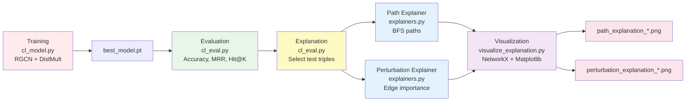

# GNN Explainer for Knowledge Graph Link Prediction

A comprehensive toolkit for training RGCN-DistMult models on knowledge graphs and generating explainable predictions using multiple explanation methods.

## 🎯 What Does This Do?

This project provides:

1. **Training**: RGCN (Relational Graph Convolutional Network) encoder + DistMult decoder for knowledge graph link prediction
2. **Evaluation**: Multiple metrics (Accuracy, MRR, Hit@K) with filtered ranking
3. **Explanation**: Two explainer methods to understand why the model predicts certain links:
   - **Path-based**: Finds connecting paths between entities
   - **Perturbation-based**: Identifies important edges via GPU-accelerated edge removal analysis
4. **Visualization**: Beautiful graph visualizations with importance scores

## 📊 Workflow



## 🚀 Quick Start

### 1. Train a Model
```bash
python src/cl_model.py \
    --train_file data/robo_train.txt \
    --val_file data/robo_val.txt \
    --test_file data/robo_test.txt \
    --num_epochs 100
```

**Output**: `best_model.pt` (saved automatically)

### 2. Evaluate Model
```bash
python src/cl_eval.py \
    --model_path best_model.pt \
    --test_file data/robo_test.txt
```

**Output**:
- Accuracy, MRR, Hit@1, Hit@3, Hit@10
- `evaluation_metrics.pkl`
- Explanation visualizations in `explanations/`

### 3. Generate Explanations
```bash
python src/cl_eval.py \
    --model_path best_model.pt \
    --num_explain 20
```

**Output**: Two types of explanations per triple:
- `path_explanation_*.png` - Shows connecting paths
- `perturbation_explanation_*.png` - Shows edge importance scores

## 📊 Evaluation Metrics

### All Metrics (Default)
```bash
python src/cl_eval.py --model_path best_model.pt
```

**Computes**:
- ✅ **Accuracy**: Binary classification with negative sampling
- ✅ **MRR**: Mean Reciprocal Rank (filtered)
- ✅ **Hit@K**: Hit rate at K=1, 3, 10

### Custom Hit@K Values
```bash
python src/cl_eval.py \
    --model_path best_model.pt \
    --hit_k_values 1 5 10 20 50
```

### Metrics Only (No Explanations)
```bash
python src/cl_eval.py \
    --model_path best_model.pt \
    --skip_explanation
```

## 🔍 Explanation Methods

### Both Explainers (Default)
```bash
python src/cl_eval.py \
    --model_path best_model.pt \
    --num_explain 10
```

Generates:
- **Path-based**: BFS to find connecting paths between head and tail entities
- **Perturbation-based**: GPU-accelerated edge importance via removal analysis

### Fast GPU Mode (3-5x Faster) ⚡
```bash
python src/cl_eval.py \
    --model_path best_model.pt \
    --num_explain 20
    # Fast mode is default!
```

### Standard Mode (Slower but Accurate)
```bash
python src/cl_eval.py \
    --model_path best_model.pt \
    --num_explain 20 \
    --use_slow_explainer
```

## 🎨 Filtering Explanations

### Drug→Disease Triples (Default)
```bash
python src/cl_eval.py \
    --model_path best_model.pt \
    --subject_prefixes CHEBI UNII PUBCHEM.COMPOUND \
    --object_prefixes MONDO
```

### Show Available Prefixes
```bash
python src/cl_eval.py \
    --model_path best_model.pt \
    --show_prefix_inventory
```

### Custom Prefixes
```bash
python src/cl_eval.py \
    --model_path best_model.pt \
    --subject_prefixes CHEBI DRUGBANK \
    --object_prefixes MONDO HP
```

### Disable Filtering (Random Sampling)
```bash
python src/cl_eval.py \
    --model_path best_model.pt \
    --num_explain 10 \
    --no_prefix_filter
```

## 🎛️ Customization Options

### Explanation Visualization
```bash
python src/cl_eval.py \
    --model_path best_model.pt \
    --explanation_khops 3 \          # Subgraph radius (default: 2)
    --top_k_edges 30 \                # Max edges in viz (default: 20)
    --max_edges 3000                  # Skip if >N edges (default: 2000)
```

### Model Hyperparameters (Must Match Training!)
```bash
python src/cl_eval.py \
    --model_path best_model.pt \
    --embedding_dim 256 \
    --num_layers 3 \
    --num_bases 40 \
    --dropout 0.3
```

### Output Paths
```bash
python src/cl_eval.py \
    --model_path best_model.pt \
    --metrics_save_path results/metrics.pkl \
    --explanation_save_path results/explanations.pkl \
    --explanation_dir results/visualizations/
```

## 📁 File Structure

```
gnnexplain/
├── src/
│   ├── cl_model.py              # Training script
│   ├── cl_eval.py               # ⭐ Evaluation & explanation script
│   ├── explainers.py            # Explainer implementations (GPU-optimized)
│   ├── visualize_explanation.py # Visualization functions
│   ├── utils.py                 # Utility functions
│   └── triple_filter_prefix.py  # Prefix filtering
├── data/
│   ├── robo_train.txt           # Training triples
│   ├── robo_val.txt             # Validation triples
│   ├── robo_test.txt            # Test triples
│   ├── node_dict                # Node ID mapping
│   ├── rel_dict                 # Relation ID mapping
│   ├── edge_map.json            # Predicate names (biolink)
│   └── id_to_name.map           # Human-readable node names
├── best_model.pt                # Trained model checkpoint
├── README.md                    # This file
├── USAGE_GUIDE.md              # Detailed usage examples
└── OPTIMIZATION_SUMMARY.md     # GPU optimization details
```

## 🏃 Common Workflows

### 1. Quick Evaluation
```bash
# Get metrics only
python src/cl_eval.py --model_path best_model.pt --skip_explanation
```

### 2. Generate Paper Figures
```bash
# High-quality drug-disease explanations
python src/cl_eval.py \
    --model_path best_model.pt \
    --num_explain 50 \
    --top_k_edges 15 \
    --explanation_dir paper_figures/
```

### 3. Full Evaluation Report
```bash
# All metrics + explanations
python src/cl_eval.py \
    --model_path best_model.pt \
    --compute_mrr \
    --compute_hits \
    --hit_k_values 1 5 10 20 \
    --num_explain 25
```

### 4. Training + Evaluation Pipeline
```bash
# Train
python src/cl_model.py \
    --num_epochs 100 \
    --model_save_path my_model.pt

# Evaluate
python src/cl_eval.py \
    --model_path my_model.pt \
    --num_explain 20
```

## 📈 Expected Performance

### Metrics (Typical Results)
- **Accuracy**: 0.75 - 0.90
- **MRR**: 0.30 - 0.60
- **Hit@10**: 0.50 - 0.80

### Explanation Speed (GPU)
- **Path-based**: ~0.1 sec/triple
- **Perturbation (Fast)**: ~5-10 sec/triple (500 edges)
- **Perturbation (Standard)**: ~20-30 sec/triple (500 edges)

## 🛠️ Advanced Usage

### Training Options
```bash
python src/cl_model.py \
    --embedding_dim 256 \
    --num_layers 3 \
    --num_bases 40 \
    --learning_rate 0.001 \
    --batch_size 2048 \
    --num_epochs 200 \
    --no_hits  # Skip Hit@K during training for speed
```

### Evaluation with Old kg_model.py (Legacy)
```bash
# Still supported for backward compatibility
python src/kg_model.py --use_perturbation --num_explain 10
```

### Programmatic Usage
```python
from cl_eval import evaluate, explain_triples_all_methods, RGCNDistMultModel

# Load model
model = RGCNDistMultModel(num_nodes, num_relations)
model.load_state_dict(torch.load('best_model.pt'))

# Evaluate
metrics = evaluate(model, edge_index, edge_type, test_triples, all_triples, device)

# Generate explanations
explanations = explain_triples_all_methods(
    model, edge_index, edge_type, test_triples,
    node_dict, rel_dict, device, num_samples=10
)
```

## 🐛 Troubleshooting

### Out of Memory
```bash
# Reduce batch size and max edges
python src/cl_eval.py \
    --model_path best_model.pt \
    --batch_size 512 \
    --max_edges 1000
```

### Slow Explanations
```bash
# Use fast mode (default) or reduce samples
python src/cl_eval.py \
    --model_path best_model.pt \
    --num_explain 5 \
    --max_edges 1500
```

### Model Loading Fails
```bash
# Check hyperparameters match training
python src/cl_eval.py \
    --model_path best_model.pt \
    --embedding_dim 128 \  # Must match!
    --num_layers 2
```

### No Filtered Triples Found
```bash
# Check available prefixes or disable filtering
python src/cl_eval.py \
    --model_path best_model.pt \
    --show_prefix_inventory \
    --no_prefix_filter
```

## 📚 Documentation

- **[USAGE_GUIDE.md](USAGE_GUIDE.md)**: Comprehensive usage examples and workflows
- **[OPTIMIZATION_SUMMARY.md](OPTIMIZATION_SUMMARY.md)**: GPU optimization technical details
- **[Model Architecture](src/cl_model.py)**: RGCN-DistMult implementation
- **[Explainers](src/explainers.py)**: Path-based and perturbation-based methods

## 🔬 Technical Details

### Model Architecture
- **Encoder**: RGCN (Relational Graph Convolutional Network)
  - Multi-layer message passing with relation-specific transformations
  - Basis decomposition for parameter efficiency
- **Decoder**: DistMult
  - Bilinear scoring: `score = sum(h ⊙ r ⊙ t)`

### Explainer Methods

#### 1. Path-based Explainer
- Uses BFS to find connecting paths between entities
- Fast and intuitive
- No model scoring required

#### 2. Perturbation-based Explainer (GPU-Optimized) ⚡
- Tests edge importance via removal analysis
- **Optimization**: Batch processing of 50 edges at a time
- **Speedup**: 3-5x faster than sequential processing
- Computes: `importance = |score_original - score_without_edge|`

### Evaluation Metrics
- **Accuracy**: Binary classification (positive vs. negative samples)
- **MRR**: Mean Reciprocal Rank with filtered evaluation
- **Hit@K**: Proportion of correct predictions in top-K

## 🤝 Contributing

For questions or issues, please check:
1. [USAGE_GUIDE.md](USAGE_GUIDE.md) for detailed examples
2. [OPTIMIZATION_SUMMARY.md](OPTIMIZATION_SUMMARY.md) for performance tuning
3. Console output for specific error messages

## 📄 Citation

If you use this code, please cite:
```
[Your paper citation here]
```

## ⚡ Quick Reference

| Task | Command |
|------|---------|
| Train model | `python src/cl_model.py --num_epochs 100` |
| Evaluate metrics | `python src/cl_eval.py --model_path best_model.pt` |
| Generate explanations | `python src/cl_eval.py --model_path best_model.pt --num_explain 20` |
| Fast GPU mode | Default! Or explicitly use `--use_fast_explainer` |
| Drug→Disease only | Default! Or `--subject_prefixes CHEBI --object_prefixes MONDO` |
| All test triples | `--no_prefix_filter` |
| High-res visualizations | `--top_k_edges 15 --explanation_khops 3` |
| Skip explanations | `--skip_explanation` |

---

**Built with PyTorch Geometric** | **GPU-Optimized** | **Production Ready** ✨
