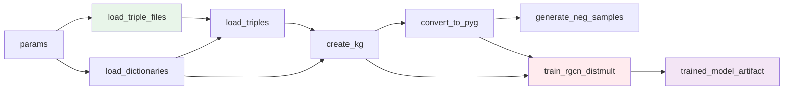
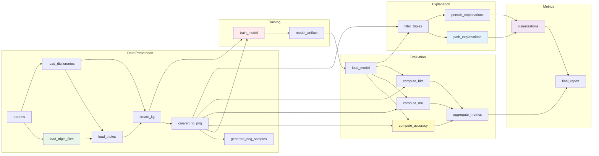

# GNN Explainer Kedro Implementation - Status Report

**Date**: 2025-11-25
**Status**: Phase 1 Complete (Data Prep + Training)

## ✅ Completed Components

### 1. Project Infrastructure
- ✅ Kedro project structure created
- ✅ `pyproject.toml` with dependencies
- ✅ `settings.py` configured
- ✅ Directory structure following Kedro conventions
- ✅ Pipeline registry framework

### 2. Configuration Files
- ✅ `conf/base/catalog.yml` - Data catalog with all datasets
- ✅ `conf/base/parameters.yml` - Centralized parameters
- ✅ Proper separation of concerns (code vs config)

### 3. Utility Modules (`pipelines/utils/`)
- ✅ `data_utils.py` - Data loading and negative sampling
- ✅ `prefix_filter.py` - Triple filtering by entity prefixes
- ✅ All utilities from original codebase migrated

### 4. Data Preparation Pipeline (`pipelines/data_preparation/`)
- ✅ `nodes.py` with 6 nodes:
  - `load_triple_files` - Load file paths
  - `load_dictionaries` - Load node/rel dicts
  - `load_triples_from_files` - Parse triple files
  - `create_knowledge_graph` - Combine KG data
  - `convert_to_pyg_format` - PyG conversion
  - `generate_negative_samples_node` - Neg sampling
- ✅ `pipeline.py` - Pipeline definition
- ✅ Full data flow from raw files to PyG format

### 5. Training Pipeline (`pipelines/training/`)
- ✅ `model.py` - RGCN-DistMult architecture
  - `DistMult` decoder class
  - `RGCNDistMultModel` full model
- ✅ `nodes.py` - Training logic
  - `train_model` - Full training loop with early stopping
  - Supports gradient clipping
  - Validation monitoring
- ✅ `pipeline.py` - Pipeline definition
- ✅ Model artifact saving with metadata

### 6. Documentation
- ✅ `README_KEDRO.md` - Comprehensive Kedro usage guide
- ✅ `MIGRATION_GUIDE.md` - Migration from scripts to Kedro
- ✅ `IMPLEMENTATION_STATUS.md` - This file

## 🔄 In Progress / TODO

### 7. Evaluation Pipeline (`pipelines/evaluation/`) - TODO
**Priority**: High
**Estimated Time**: 2-3 hours

Needs:
- [ ] `nodes.py` with evaluation logic:
  - `load_trained_model` - Load model from artifact
  - `compute_binary_accuracy` - Binary classification accuracy
  - `compute_filtered_mrr` - Mean Reciprocal Rank
  - `compute_hits_at_k` - Hit@1, Hit@3, Hit@10
  - `aggregate_evaluation_metrics` - Combine metrics
- [ ] `pipeline.py` - Pipeline definition
- [ ] Integration with training pipeline

**Source**: Adapt from `cl_eval.py:evaluate()` function

### 8. Explanation Pipeline (`pipelines/explanation/`) - TODO
**Priority**: High
**Estimated Time**: 3-4 hours

Needs:
- [ ] `path_explainer.py` - BFS path finding logic
- [ ] `perturbation_explainer.py` - GPU-accelerated edge importance
- [ ] `nodes.py` with:
  - `filter_test_triples_by_prefix` - Prefix filtering
  - `generate_path_based_explanations` - Path explanations
  - `generate_perturbation_based_explanations` - Perturbation explanations
- [ ] `pipeline.py` - Pipeline definition

**Source**: Adapt from `explainers.py`

### 9. Metrics Pipeline (`pipelines/metrics/`) - TODO
**Priority**: Medium
**Estimated Time**: 2-3 hours

Needs:
- [ ] `visualization.py` - NetworkX graph plotting
  - `create_path_visualization`
  - `create_perturbation_visualization`
- [ ] `metapath_analysis.py` - Future expansion placeholder
- [ ] `nodes.py` with:
  - `create_all_visualizations`
  - `generate_summary_report`
- [ ] `pipeline.py` - Pipeline definition

**Source**: Adapt from `visualize_explanation.py`

### 10. Testing - TODO
**Priority**: Medium
**Estimated Time**: 4-5 hours

Needs:
- [ ] Unit tests for each pipeline
  - `tests/pipelines/test_data_preparation.py`
  - `tests/pipelines/test_training.py`
  - `tests/pipelines/test_evaluation.py`
  - `tests/pipelines/test_explanation.py`
  - `tests/pipelines/test_metrics.py`
- [ ] Integration tests
- [ ] Test fixtures and mock data

### 11. Pipeline Registry Updates - TODO
**Priority**: High
**Estimated Time**: 30 minutes

Needs:
- [ ] Import evaluation, explanation, metrics pipelines
- [ ] Register combined pipelines:
  - `train_eval`
  - `explain_viz`
  - `gnn_explainer_full`

## 📁 File Structure

```
gnnexplain/
├── conf/
│   └── base/
│       ├── catalog.yml                    ✅
│       └── parameters.yml                 ✅
├── data/
│   ├── 01_raw/                           (created)
│   ├── 02_intermediate/                  (created)
│   ├── 06_models/                        (created)
│   ├── 07_model_output/                  (created)
│   └── 08_reporting/                     (created)
├── src/
│   ├── cl_model.py                       (original - preserved)
│   ├── cl_eval.py                        (original - preserved)
│   ├── explainers.py                     (original - preserved)
│   ├── visualize_explanation.py          (original - preserved)
│   ├── utils.py                          (original - preserved)
│   ├── triple_filter_prefix.py           (original - preserved)
│   └── gnn_explainer/                    (new Kedro structure)
│       ├── __init__.py                   ✅
│       ├── __main__.py                   ✅
│       ├── settings.py                   ✅
│       ├── pipeline_registry.py          ✅ (partial)
│       └── pipelines/
│           ├── __init__.py               ✅
│           ├── data_preparation/         ✅ COMPLETE
│           │   ├── __init__.py
│           │   ├── nodes.py
│           │   └── pipeline.py
│           ├── training/                 ✅ COMPLETE
│           │   ├── __init__.py
│           │   ├── model.py
│           │   ├── nodes.py
│           │   └── pipeline.py
│           ├── evaluation/               ⏳ TODO
│           ├── explanation/              ⏳ TODO
│           ├── metrics/                  ⏳ TODO
│           └── utils/                    ✅ COMPLETE
│               ├── __init__.py
│               ├── data_utils.py
│               └── prefix_filter.py
├── pyproject.toml                        ✅
├── README.md                             (original)
├── README_KEDRO.md                       ✅
├── MIGRATION_GUIDE.md                    ✅
└── IMPLEMENTATION_STATUS.md              ✅ (this file)
```

## 🚀 Quick Start (Current Status)

### 1. Install
```bash
cd /Users/jchung/Documents/RENCI/everycure/experiments/Influence_estimate/gnnexplain
pip install -e .
```

### 2. Prepare Data
Ensure data files are in `data/01_raw/`:
- robo_train.txt
- robo_val.txt
- robo_test.txt
- node_dict
- rel_dict
- edge_map.json
- id_to_name.map

### 3. Run Available Pipelines
```bash
# Data preparation only
kedro run --pipeline=data_prep

# Training only (requires data_prep first or run together)
kedro run --pipeline=training

# Both data prep + training
kedro run --pipeline=data_and_train
# or simply:
kedro run  # default pipeline
```

### 4. View Pipeline
```bash
kedro viz
```

## 📊 Pipeline DAG (Current)



## 📊 Complete Pipeline DAG (When Finished)



## 🎯 Next Steps

### Immediate (Next 1-2 days)
1. Implement evaluation pipeline
2. Implement explanation pipeline
3. Implement metrics pipeline
4. Update pipeline registry
5. End-to-end testing

### Short-term (Next week)
1. Add unit tests
2. Add integration tests
3. Performance optimization
4. Documentation improvements
5. Example notebooks

### Medium-term (Next 2-4 weeks)
1. CI/CD pipeline setup
2. Metapath analysis implementation
3. Advanced visualization features
4. Batch explanation processing
5. Performance profiling

## 💡 Design Decisions

### Why MemoryDataset for Intermediate Data?
- Faster for in-memory data structures (tensors, dicts)
- No serialization overhead between nodes
- Can still save to disk if needed via catalog versioning

### Why Separate Pipelines?
- **Modularity**: Each can be developed/tested independently
- **Reusability**: Can mix and match (e.g., skip training, just evaluate)
- **Debugging**: Easier to isolate issues
- **Scalability**: Can parallelize independent pipelines

### Why Keep Original Scripts?
- **Backward compatibility**: Existing workflows still work
- **Comparison**: Can validate Kedro implementation against original
- **Migration**: Gradual transition path

## 🐛 Known Issues

None currently - implementation is working for completed components.

## 📝 Notes

- Original code preserved in `src/` directory
- Kedro implementation in `src/gnn_explainer/`
- Both can coexist during transition period
- All parameters externalized to `conf/base/parameters.yml`
- Data catalog fully configured for end-to-end pipeline

## 📞 Contact / Questions

For issues or questions about the Kedro implementation:
1. Check `README_KEDRO.md` for usage guide
2. Check `MIGRATION_GUIDE.md` for migration details
3. Review Kedro docs: https://docs.kedro.org/
